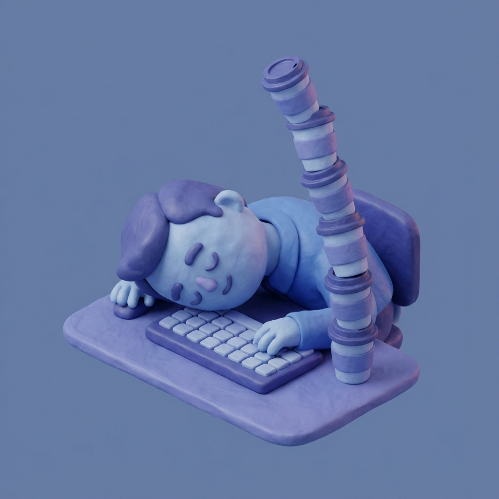
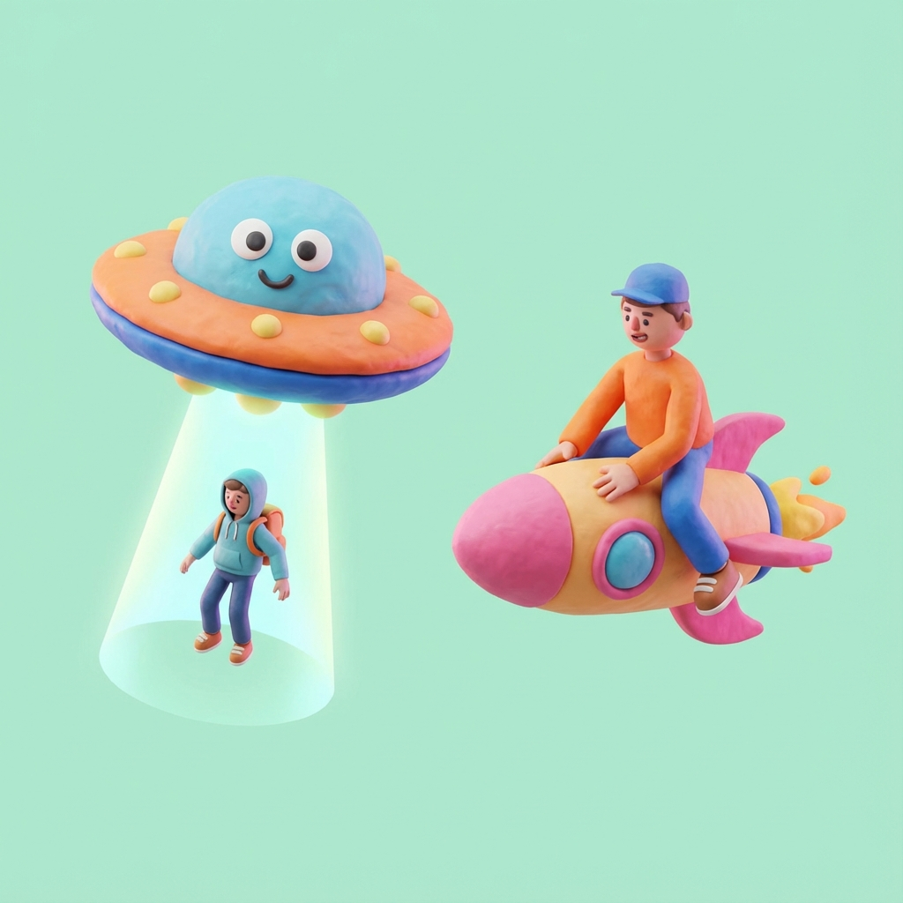

# Chicken Party: Event Design & Assets

This document outlines the design and assets for the "Chicken Party" yearly settlement events.

## Overview
At the end of each year, a settlement event occurs. If a partner leaves, a "Departure Event" is triggered. If everyone stays, a "Chicken Party" is triggered.

## Departure Events
We have categorized departure reasons into 4 main types, each with a distinct visual theme.

### 1. Career Growth
**Theme**: Moving on to better opportunities (Higher pay, better role).
**Current Asset**: 3D Isometric Clay Style

**Reasons**:
- "I received an offer from a competitor that pays 50% more. I can't say no."
- "I feel like I've stopped growing here. I need a new challenge."
- "A headhunter reached out with a Senior Architect role. It's the next step for me."
- "I'm starting my own startup. Thanks for the inspiration!"

### 2. Burnout
**Theme**: Exhaustion, stress, and poor work-life balance.
**Current Asset**: 3D Isometric Clay Style

**Reasons**:
- "I'm burnt out. I haven't seen the sun in three weeks."
- "The crunch culture here is too much. I need to prioritize my health."
- "I can't deal with the spaghetti code anymore. It's haunting my dreams."
- "I feel unappreciated. My contributions are always overlooked."

### 3. Personal Life
**Theme**: Life changes unrelated to the company (Moving, family, dreams).
**Current Asset**: 3D Isometric Clay Style

**Reasons**:
- "My partner got a job in another city, so we're moving."
- "I'm taking a sabbatical to hike the Pacific Crest Trail."
- "I'm going back to school to get my PhD in AI."
- "I'm retiring early to become a full-time streamer."

### 4. Outrageous
**Theme**: Absurd, humorous, and random events.
**Current Asset**: 3D Isometric Clay Style

**Reasons**:
- "I was summoned by a secret society of coders to save the internet."
- "My cat learned to code and we're launching a rival app."
- "I realized I'm actually a simulation and I'm trying to break out."
- "A time traveler told me this company collapses in 2026. Sorry!"

## Technical Implementation
- **Logic**: `src/Game.js` handles the random selection of categories and specific reasons.
- **UI**: `src/UIManager.js` displays the event modal with the corresponding image.
- **Assets**: Images are stored in `assets/images/events/`.
